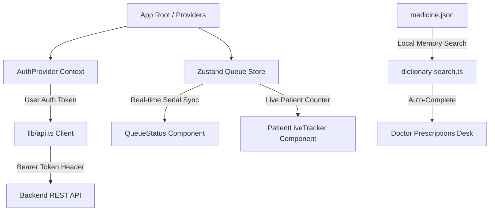

# 🏥 Patient & Doctor Management System — Frontend Client

[](https://nextjs.org/)
[](https://react.dev/)
[](https://www.typescriptlang.org/)
[](https://tailwindcss.com/)
[](https://zustand-demo.pmnd.rs/)
[](https://vercel.com/)

A modern, high-performance, responsive Web Application for clinical queue management, real-time patient tracking, dynamic prescription generation, and multi-role healthcare administration. Built with **Next.js 16 (App Router)**, **React 19**, **TypeScript**, and **Tailwind CSS v4**.

---

## 🌟 Key Features

- **🔐 Multi-Role Authentication & Access Control**
  - Custom RBAC dashboard layouts tailored for **Admin**, **Doctor**, **Receptionist**, and **Patient**.
  - Persistent authentication via HTTP-only cookie tokens & `useAuth` React Context.
- **🩺 Interactive Prescription Generator**
  - Dynamic prescription creation with real-time preview and vitals tracking (BP, Pulse, Weight, Temp, SpO2).
  - Standardized dosage frequency formatting (e.g., `1+0+1`, `0+1+0`) and duration/instruction tags.
- **💊 Offline Medicine Dictionary & Auto-Complete**
  - Ultra-fast client-side search across a **7.8MB local drug database** (`medicine.json`).
  - Support for custom clinic medicine additions with zero server overhead.
- **📋 Real-Time Patient Queue System**
  - Live serial status updates managed by **Zustand** state store.
  - Public live tracker allowing patients to track their position in line (`Serials Ahead`) in real-time.
- **🖨️ Print & Export Prescriptions**
  - One-click print layout and image export powered by `html-to-image`.
  - Professional hospital letterhead integration with customizable clinic branding.
- **✨ Modern Aesthetics & Responsive Design**
  - Glassmorphic UI elements, interactive micro-animations, sleek dark mode accents, and Lucide icons.

---

## 🏗️ Tech Stack

| Domain | Technology / Library | Purpose |
| :--- | :--- | :--- |
| **Framework** | [Next.js 16 (App Router)](https://nextjs.org) | SSR/SSG Routing & Application Core |
| **UI Library** | [React 19](https://react.dev) | Frontend Component Architecture |
| **Language** | [TypeScript 5](https://www.typescriptlang.org) | End-to-end Static Type Safety |
| **Styling** | [Tailwind CSS v4](https://tailwindcss.com) + `@tailwindcss/postcss` | Modern CSS Framework & Design Tokens |
| **State Management** | [Zustand 5](https://zustand-demo.pmnd.rs) + React Context | Client Queue State & Global Auth |
| **Icons** | [Lucide React](https://lucide.dev) | Modern Vector UI Icons |
| **Export Utility** | `html-to-image` | Canvas / Image Generation for RX Printing |
| **Auth Cookies** | `js-cookie` | Client-Side Cookie Parsing & Storage |

---

## 📁 Directory Structure

```
patient-management-system-client/
├── app/                        # Next.js 16 App Router Directory
│   ├── admin/                  # Admin Dashboard & User Management
│   ├── doctor/                 # Doctor Dashboard & RX Editor
│   ├── receptionist/           # Receptionist Queue & Booking Desk
│   ├── login/                  # User Sign-in Page
│   ├── register/               # Registration & Doctor Request Form
│   ├── track/                  # Public Live Queue Tracker Page
│   ├── layout.tsx              # Root Layout with Auth Provider
│   ├── page.tsx                # Public Landing Page & Booking UI
│   └── globals.css             # Tailwind v4 Styles & Custom Utilities
├── components/                 # Reusable UI & Feature Components
│   ├── AdminSidebar.tsx        # Admin Navigation Sidebar
│   ├── AppointmentBooking.tsx  # Patient Booking Wizard Modal
│   ├── ClinicBrandingSettings.tsx # Clinic Branding Configuration
│   ├── DoctorDashboard.tsx     # Comprehensive Doctor Desk & RX Desk
│   ├── DoctorSidebar.tsx       # Doctor Workspace Navigation
│   ├── MedicineManager.tsx     # Custom Drug Dictionary Manager
│   ├── Navbar.tsx              # Header Navigation Bar
│   ├── PatientLiveTracker.tsx  # Real-time Public Serial Tracker Component
│   ├── PrescriptionsList.tsx   # Prescription History & Archive Viewer
│   ├── PrintablePrescription.tsx # Printable RX Sheet Template
│   ├── ProfileSettings.tsx     # User Profile & Password Updates
│   ├── PublicHomePageSettings.tsx # Landing Page Customization Panel
│   ├── QueueStatus.tsx         # Live Queue Management Desk
│   └── ReceptionistSidebar.tsx # Receptionist Workspace Navigation
├── hooks/                      # Custom React Hooks
│   └── useAuth.tsx             # Global Auth & Role Checking Hook
├── lib/                        # Utility Functions & API Helpers
│   ├── api.ts                  # Centralized Fetch API Wrapper with Bearer Auth
│   └── dictionary-search.ts    # Fast Medicine Auto-complete Search Engine
├── public/                     # Static Assets & Images
├── custom-medicines.json       # Clinic-specific Custom Drugs Database
├── medicine.json               # Full Local Medicine Dictionary (~7.8MB)
├── package.json                # Dependencies & Build Scripts
├── tsconfig.json               # TypeScript Configuration
└── next.config.ts              # Next.js Runtime Configuration
```

---

## ⚡ Getting Started

### 1. Prerequisites
- **Node.js**: `v20.x` or higher
- **npm** / **yarn** / **pnpm** / **bun**

### 2. Environment Configuration
Create a `.env.local` file in the `patient-management-system-client` root directory:

```env
# Backend API Base URL (Local Development)
NEXT_PUBLIC_API_URL=http://localhost:5000/api

# For Production (Vercel Deployment)
# NEXT_PUBLIC_API_URL=https://your-backend-api.vercel.app/api
```

### 3. Installation & Local Execution

```bash
# Clone repository or navigate to directory
cd patient-management-system-client

# Install dependencies
npm install

# Start the Next.js development server
npm run dev
```

Open [http://localhost:3000](http://localhost:3000) in your browser.

---

## 🔄 State Architecture



---

## 📜 Available Scripts

- `npm run dev` — Starts local development server on `http://localhost:3000`.
- `npm run build` — Builds the application for production deployment.
- `npm run start` — Starts Next.js production server.
- `npm run lint` — Runs ESLint code quality checks.

---

## 🚀 Deployment (Vercel)

This frontend client is fully optimized for **Vercel**:

1. Connect your repository to Vercel.
2. Set Root Directory to `patient-management-system-client`.
3. Add Environment Variable: `NEXT_PUBLIC_API_URL` pointing to your live backend endpoint.
4. Deploy! Next.js will build pages with static optimization and dynamic server components.

---

## 📄 License
This project is licensed under the [MIT License](LICENSE).
